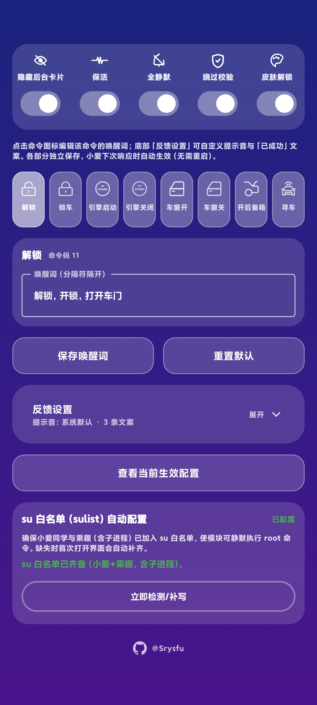

# HelloChengQu

**小爱语音 ➜ 乘趣车控**

一句话控制你的车，锁屏也能用。

---

## 主界面预览

---

## 快速开始

### 安装

1. 下载 [HelloChengQu-v1.2.apk](https://github.com/Srysfu/HelloChengQu/releases/latest)
2. LSPosed 中勾选：小爱同学 + 乘趣
3. 重启手机

### 使用

对小爱说：

- "开车窗" - 车窗降下
- "锁车" - 车门上锁
- "启动引擎" - 一键打火
- "寻车" - 鸣笛闪灯

就这么简单。

---

## 功能列表

| 功能 | 状态 |
|------|------|
| 车辆解锁/上锁 | ✅ |
| 引擎启动/熄火 | ✅ |
| 车窗升降 | ✅ |
| 后备箱开启 | ✅ |
| 车辆寻找 | ✅ |
| 锁屏控制 | ✅ |
| 口语化识别 | ✅ |

---

## 命令示例

**解锁/锁车**
- "开锁" / "解锁" / "打开车门"
- "锁车" / "上锁" / "锁门"

**引擎控制**
- "打火" / "启动引擎" / "一键启动"
- "熄火" / "关闭引擎" / "关火"

**车窗控制**
- "开窗" / "降窗" / "打开车窗"
- "关窗" / "升窗" / "关闭车窗"

**其他**
- "开后备箱" / "开尾箱"
- "寻车" / "找车"

支持更多口语化表达，不用记标准词。

---

## 系统要求

- ✅ Android 14+
- ✅ Root 权限（Magisk / KernelSU）
- ✅ LSPosed 模块框架
- ✅ 小爱同学 (com.miui.voiceassist)
- ✅ 乘趣车控 (com.ingeek.nokey)

---

## 测试通过

- **设备**: Redmi Note 10 Pro
- **系统**: HyperOS Android 14
- **场景**: 锁屏/亮屏均可用

---

## 技术说明

本模块通过 LSPosed Hook 实现：
- 拦截小爱语音意图
- 翻译为乘趣车控命令
- 通过广播发送指令
- ACK 确认机制保证送达
- Root 权限唤醒冻结进程

即使在省电模式下也能可靠工作。

---

## 常见问题

**Q: 为什么要 root？**  
A: 锁屏时系统会冻结后台进程，需要 root 权限强制唤醒。

**Q: 支持其他语音助手吗？**  
A: 目前只支持小爱同学，其他助手需要额外适配。

**Q: 会不会耗电？**  
A: 不会。模块只在语音触发时工作，平时不占用资源。

**Q: 安全吗？**  
A: 所有代码开源，不联网，不上传数据。

---

## 开源协议

MIT License

---

## 免责声明

本项目仅供学习交流使用。请在合法拥有的车辆上使用，并遵守当地法律法规。作者不对任何滥用行为负责。

---

## 相关链接

- [下载最新版本](https://github.com/Srysfu/HelloChengQu/releases/latest)
- [问题反馈](https://github.com/Srysfu/HelloChengQu/issues)
- [LSPosed 官网](https://github.com/LSPosed/LSPosed)