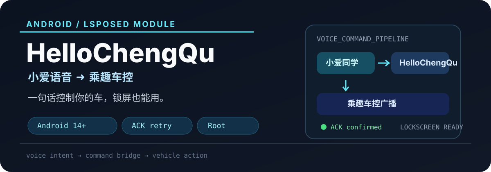

<p align="center">
  
</p>

<p align="center">
  <a href="https://github.com/Srysfu/HelloChengQu/releases/latest"></a>
  <a href="https://developer.android.com/"></a>
  <a href="https://github.com/LSPosed/LSPosed"></a>
  
</p>

<p align="center"><strong>小爱语音 ➜ 乘趣车控</strong><br>把自然语言变成车辆控制指令，锁屏也能用。</p>

## 这个模块解决什么问题？

`HelloChengQu` 是一个 Android LSPosed 模块，为小爱同学和乘趣车控之间提供语音控制桥接：

- 说“锁车”“开窗”“启动引擎”或“寻车”，直接触发对应车辆操作
- 支持多种口语化表达，不需要记固定命令
- 通过 ACK 确认与重试机制提高广播送达可靠性
- 针对 Android 14 锁屏场景，支持唤醒被冻结的后台进程

## 快速开始

### 前置条件

- Android 14 或更高版本
- Root 权限：Magisk 或 KernelSU
- LSPosed 模块框架
- 小爱同学：`com.miui.voiceassist`
- 乘趣车控：`com.ingeek.nokey`

### 安装

1. 从 [Releases](https://github.com/Srysfu/HelloChengQu/releases/latest) 下载最新 APK。
2. 在 LSPosed 中同时勾选“小爱同学”和“乘趣”。
3. 重启手机。
4. 先在亮屏状态验证命令，再测试锁屏控制。

### 第一次使用

对小爱同学说：

```text
“锁车”
```

如果车辆正常上锁，再尝试“开车窗”“启动引擎”或“寻车”。

## 支持的语音命令

| 操作 | 可用说法 |
| --- | --- |
| 解锁 | `开锁`、`解锁`、`打开车门` |
| 锁车 | `锁车`、`上锁`、`锁门` |
| 启动引擎 | `打火`、`启动引擎`、`一键启动` |
| 熄火 | `熄火`、`关闭引擎`、`关火` |
| 开窗 | `开窗`、`降窗`、`打开车窗` |
| 关窗 | `关窗`、`升窗`、`关闭车窗` |
| 开后备箱 | `开后备箱`、`开尾箱` |
| 寻车 | `寻车`、`找车` |

## 工作原理

```text
小爱同学语音
      │
      ▼
LSPosed Hook 拦截语音意图
      │
      ▼
HelloChengQu 翻译为乘趣车控命令
      │
      ▼
广播发送 + ACK 确认 / 失败重试
      │
      ▼
乘趣车控执行车辆操作
```

模块只在语音触发时工作，平时不主动联网，也不上传数据。

## 已验证环境

- 设备：Redmi Note 10 Pro
- 系统：HyperOS / Android 14
- 场景：亮屏和锁屏

目前只适配小爱同学与乘趣车控。其他语音助手或车型需要额外适配，不能据此推断兼容性。

## 常见问题

<details>
<summary><strong>为什么需要 Root？</strong></summary>

锁屏时系统可能冻结后台进程，模块需要 Root 权限唤醒相关进程，才能保证车控广播被处理。
</details>

<details>
<summary><strong>会不会耗电？</strong></summary>

模块只在语音触发时工作，按照当前实现，平时不进行持续轮询。
</details>

<details>
<summary><strong>安全吗？</strong></summary>

项目代码公开，模块本身不联网、不上传数据。但车辆控制属于高风险操作，请仅在合法拥有并确认安全的车辆上使用。
</details>

## 免责声明

本项目仅供学习和交流使用。请遵守当地法律法规，并在合法拥有的车辆上使用。作者不对误操作、车辆状态、环境条件或任何滥用行为造成的后果负责。

## 开源协议

项目声明采用 MIT License 开源。

## 相关链接

- [下载最新版本](https://github.com/Srysfu/HelloChengQu/releases/latest)
- [提交问题或反馈](https://github.com/Srysfu/HelloChengQu/issues)
- [LSPosed](https://github.com/LSPosed/LSPosed)